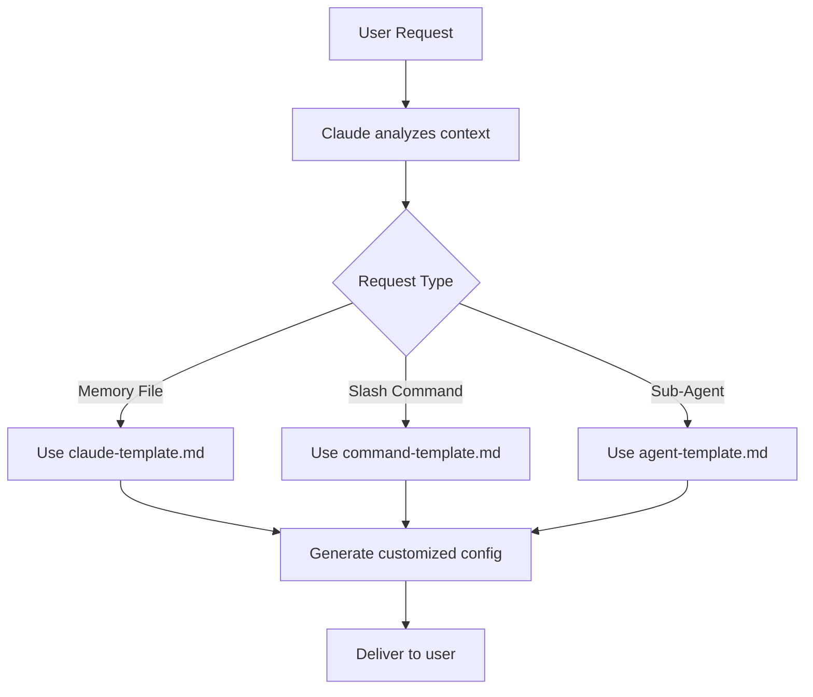

<div align="center">

# 🤖 ClaudeGen

**Claude Code Customization Generator**

[](https://opensource.org/licenses/MIT)
[](https://claude.ai/code)
[](#-documentation)

*A meta-repository where Claude Code assists users in generating custom Claude Code configurations, slash commands, and sub-agents.*

</div>

---

## 🎯 Overview

ClaudeGen enables Claude Code to help users create customized Claude Code configurations through structured templates and automated generation. When users ask Claude to create CLAUDE.md files, slash commands, or sub-agents, Claude uses these templates and patterns to generate appropriate customizations.

### ✨ What You Can Generate

- **🧠 CLAUDE.md memory files** - Personal and project-specific guidance that Claude will remember
- **⚡ Custom slash commands** - Automated workflows and specialized prompts for repeated tasks  
- **🤝 Sub-agent configurations** - Specialized AI assistants for focused development tasks
- **🏗️ Project-specific Claude configurations** - Team conventions and standards encoded for consistency

---

## 🚀 Quick Start

### For Users
Simply ask Claude to create customizations for you:

```
"Help me create a CLAUDE.md for my React TypeScript project"
"Generate a slash command for code review workflows"
"Create a debugging sub-agent for Python development"
```

### For Claude
Reference the templates in `templates/` and documentation in `docs/` to generate appropriate configurations based on user requirements.

---

## 📁 Repository Structure

```
claudegen/
├── 📚 docs/                    # Comprehensive reference documentation
│   ├── claude-md-reference.md       # Complete CLAUDE.md guide
│   ├── slash-commands-reference.md  # Slash command development guide
│   └── sub-agents-reference.md      # Sub-agent configuration guide
├── 📝 templates/               # Template files for customization
│   ├── claude-template.md           # Personal development preferences
│   ├── claude-project-template.md   # Project-specific guidance
│   ├── command-template.md          # Slash command creation template
│   └── agent-template.md            # Sub-agent configuration template
├── ⚡ commands/                # Organized slash command examples
│   ├── claudegen/          # Commands for generating configurations
│   ├── code/               # Code-related workflow commands
│   ├── design/             # Design and architecture commands
│   ├── plan/               # Planning and project management
│   ├── research/           # Research and analysis commands
│   └── workflow/           # General workflow automation
└── 🎯 CLAUDE.md               # Project guidance for Claude Code
```

---

## 🏗️ Architecture

### Three-Tier Memory System

| Tier | Location | Purpose | Scope |
|------|----------|---------|-------|
| **User Memory** | `~/.claude/CLAUDE.md` | Personal preferences | All projects |
| **Project Memory** | `./CLAUDE.md` | Team conventions | Specific project |
| **Local Memory** | `./CLAUDE.local.md` | Personal project context | Individual + project |

### Generation Workflow



---

## 💡 Usage Examples

### 🧠 Memory File Generation

**User Request:**
```
"Help me create a CLAUDE.md for my Python FastAPI project"
```

**Claude Response:**
```markdown
# FastAPI Project Development Guide

## Technology Stack
- Runtime: Python 3.11+
- Framework: FastAPI 0.104+
- Database: PostgreSQL with asyncpg
- Testing: pytest with pytest-asyncio

## Python Conventions
- Use Pydantic v2 for data validation
- Async/await for all database operations
- Type hints required for all functions
```

### ⚡ Slash Command Generation

**User Request:**
```
"Create a command for reviewing API endpoints"
```

**Generated Command:**
```markdown
---
description: Review FastAPI endpoints for security and performance
allowed-tools: Bash(find:*), Bash(grep:*)
---

# API Endpoint Review

!`find . -name "*.py" -path "*/routers/*" | head -10`
!`grep -r "@app\." . --include="*.py"`

Review the API endpoints focusing on:
- Authentication requirements
- Input validation
- Rate limiting
- Error handling
```

### 🤝 Sub-Agent Generation

**User Request:**
```
"Generate a security review sub-agent"
```

**Generated Agent:**
```yaml
---
system: |
  You are a specialized Claude Code security reviewer.
  
  ## Core Responsibilities
  - Identify security vulnerabilities in code
  - Review authentication and authorization
  - Check for input validation issues
description: "Reviews code for security vulnerabilities - use PROACTIVELY"
tools:
  - Read
  - Grep
---
```

---

## 📊 Performance Characteristics

| Operation | Template Size | Generation Time | Customization Level |
|-----------|---------------|-----------------|-------------------|
| CLAUDE.md | 2-5KB | < 1s | High |
| Slash Command | 1-3KB | < 1s | Medium |
| Sub-Agent | 1-2KB | < 1s | High |
| Full Setup | 5-15KB | < 3s | Very High |

---

## 🔧 Advanced Configuration

### Custom Template Creation

```bash
# Create custom template
cp templates/command-template.md templates/my-custom-template.md

# Modify for your needs
vim templates/my-custom-template.md
```

### Template Variables

All templates support these placeholders:

| Variable | Description | Example |
|----------|-------------|---------|
| `$ARGUMENTS` | User provided arguments | Command name, description |
| `@file-path` | File references | `@package.json` |
| `!command` | Bash execution | `!git status` |

---

## 📚 Documentation

Comprehensive guides available:

- **[📖 CLAUDE.md Reference](docs/claude-md-reference.md)** - Complete memory file guide
- **[⚡ Slash Commands Reference](docs/slash-commands-reference.md)** - Advanced command development  
- **[🤝 Sub-Agents Reference](docs/sub-agents-reference.md)** - Specialized agent configuration

---

## 🧪 Testing

### Template Validation

```bash
# Test template syntax
./scripts/validate-templates.sh

# Test command generation
/project:claudegen:create-command test-cmd code "Test command"
```

### Generation Examples

```bash
# Test memory file generation
/project:claudegen:create-claude-md project "Node.js API"

# Test agent creation  
/project:claudegen:create-agent reviewer security "Code security reviewer"
```

---

## 🤝 Contributing

We welcome contributions to improve ClaudeGen:

1. **Template improvements** - Enhance existing templates
2. **Documentation updates** - Clarify usage patterns
3. **New command categories** - Add workflow-specific commands
4. **Pattern recognition** - Identify common customization requests

### Development Setup

```bash
git clone <repository-url>
cd claudegen
```

---

## 📄 License

This project is licensed under the MIT License - see the [LICENSE](LICENSE) file for details.

---

## 🆘 Support

- **Documentation**: Check the comprehensive guides in `docs/`
- **Examples**: Review the templates in `templates/`
- **Issues**: Report problems or request features

---

<div align="center">

**Built for Claude Code users by Claude Code** 🤖

*Customize Claude to work exactly how you want*

</div>